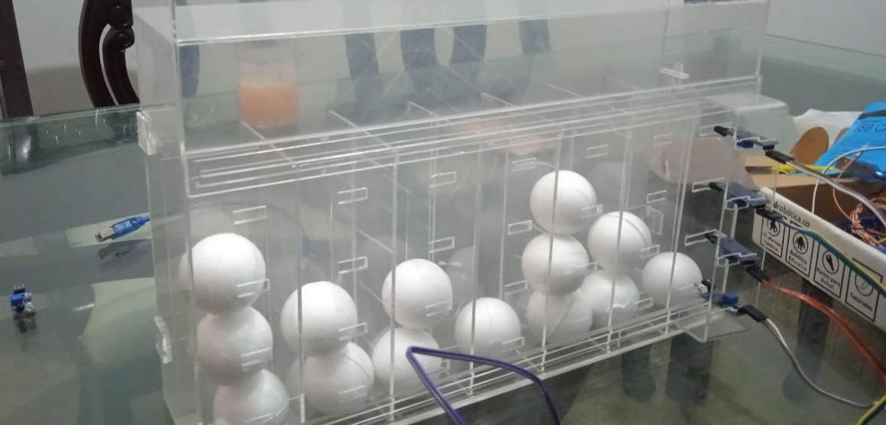
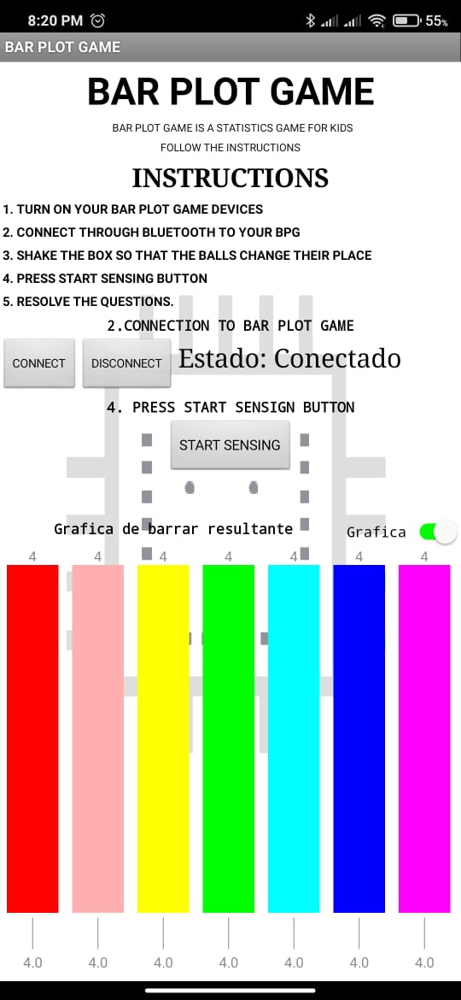
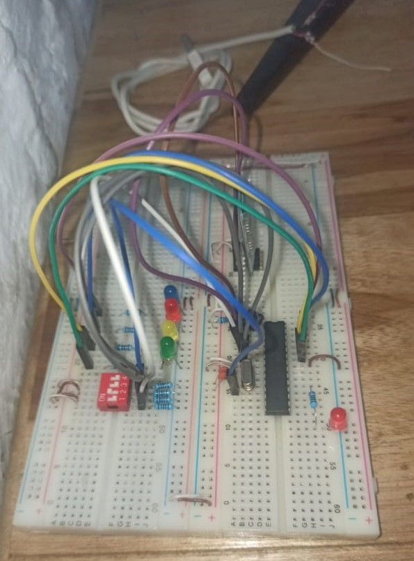
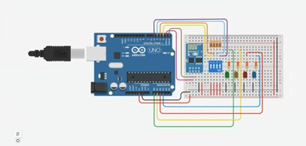

# Bar Plot Game - Proyecto

## Carpetas

- **Comunicacion_microapp:** Contiene archivos `.c` y `.h` para programar el microcontrolador.
- **Bart_Plot_Game.aia:** Aplicación móvil del proyecto.

## Descripción del Proyecto

Este proyecto implementa el juego de Gráfico de Barras, donde el usuario coloca bolas dentro de una caja que luego se agita para distribuir las bolas aleatoriamente. Un microcontrolador detecta la presencia de bolas columna por columna y comunica las medidas al smartphone a través de sensores. La aplicación móvil muestra los resultados y plantea preguntas a los niños basadas en el gráfico de barras resultante.

## Consideraciones

Para ejecutar el proyecto, considera lo siguiente:

- Después de agitar la caja, déjala en reposo para obtener respuestas confiables de los sensores al microcontrolador.
- Asegúrate de tener instalada previamente la aplicación "Bar Plot Question" en tu teléfono y conecta el módulo Bluetooth para establecer la comunicación con el microcontrolador.

## Instrucciones del Juego

1. Conecta tu smartphone a la aplicación.
2. Sigue las instrucciones proporcionadas en la aplicación.
3. Utiliza el módulo de conexión/desconexión Bluetooth para comenzar a resolver las preguntas basadas en los resultados del juego.

### Descripción de la Estructura

La estructura está diseñada en acrílico en forma de un rectángulo 3D con un ancho de 30 cm y un largo de 35 cm. Contiene siete carriles con una tapa, y cada carril tiene cuatro lugares para colocar las bolas. Hay un conjunto de 4 sensores dispuestos en una regleta vertical en el lado derecho de la caja (columna 1). El usuario debe ubicar la regleta en cada columna, esperando que detecte la presencia de las pelotas hasta llegar al lado izquierdo de la caja (columna 7).

### Aplicación Móvil

La aplicación móvil permite la interacción con el proyecto y muestra los resultados del juego.

### Circuito Implementado de Comunicación

El circuito de comunicación está diseñado para conectar el microcontrolador y el módulo Bluetooth para una comunicación efectiva con la aplicación móvil.

Para más detalles, visita las carpetas correspondientes.

Este repositorio contiene los archivos necesarios para programar el microcontrolador y la aplicación móvil para disfrutar del juego de Gráfico de Barras. ¡Diviértete y aprende al mismo tiempo!

Para más detalles, visita la carpeta correspondiente.
